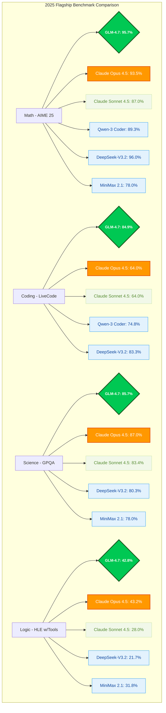
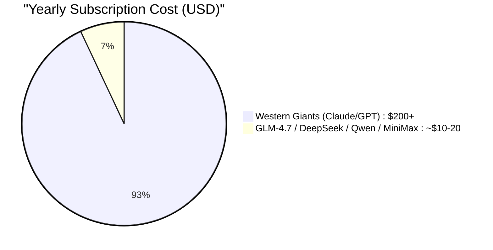

# 🚀 GLM-4.7 vs. The $200 Giants: Is China's $3 AI Coding Tool the New Market King?

```text
██████╗ ██╗     ███╗   ███╗      ██╗  ██╗    ███████╗
██╔════╝ ██║     ████╗ ████║      ██║  ██║    ╚════██║
██║  ███╗██║     ██╔████╔██║█████╗███████║        ██╔╝
██║   ██║██║     ██║╚██╔╝██║╚════╝╚════██║       ██╔╝ 
╚██████╔╝███████╗██║ ╚═╝ ██║           ██║       ██║  
 ╚═════╝ ╚══════╝╚═╝     ╚═╝           ╚═╝       ╚═╝  
      THE FRONTIER AGENTIC REASONING MODEL (2025)
```

### 💡 Key Takeaways (TL;DR)
- **GLM-4.7** is the new **SOTA (State of the Art)** AI coding model for 2025.
- Developed by **Zhipu AI**, it offers enterprise-level performance matching or exceeding flagship models like **Claude Sonnet 4.5** and **GPT-5.1**.
- **Price Point**: $0.60 per 1M input tokens ($0.11 cached), $2.20 per 1M output tokens vs. $3.00/$15.00 for Claude Sonnet 4.5.
- **Context Window**: Massive **200K tokens** for full codebase analysis.
- **Best For**: Cost-conscious developers, agentic workflows, and high-complexity debugging.

The global landscape for AI-powered development is shifting. While Western tools like **Cursor Pro** and **GitHub Copilot** have dominated by charging premium subscription rates (often reaching $200 per year), a new contender from Beijing, China, has arrived to dismantle that pricing model.

**Zhipu AI** has released **GLM-4.7**, a large language model specifically engineered for coding, offering performance that rivals top-tier US models at a fraction of the cost. With a price point of **$0.60 per 1M input tokens** (dropping to **$0.11** with caching) and **$2.20 per 1M output tokens**, GLM-4.7 is forcing developers to question if expensive subscriptions are still necessary.

---

## ⚔️ The Frontier Battle: Verified Benchmarks

GLM-4.7 demonstrates competitive performance against the newest generation of flagship models, including **Claude Sonnet 4.5** and **GPT-5.1**, based on the latest 2025 public technical reports.

### 📊 2025 AI Coding Model Performance Comparison
*Note: Best scores per category are highlighted in $\color{green}{\text{green}}$.*



| Category | Benchmark | **GLM-4.7** | Claude Opus 4.5 | Claude Sonnet 4.5 | GPT-5.1 | Qwen-3 Coder | DeepSeek-V3.2 | MiniMax 2.1 | Source |
| :--- | :--- | :--- | :--- | :--- | :--- | :--- | :--- | :--- | :--- |
| **Math** | AIME 25 | $\color{green}{\textbf{95.7}}$ | 93.5 | 87.0 | 94.6 | 89.3 | $\color{green}{\textbf{96.0}}$ | 78.0 | [Z.ai Tech Report] • [Anthropic] • [Qwen Tech Report] • [Ollama] |
| **Coding** | LiveCodeBench | 84.9 | 64.0 | 64.0 | $\color{green}{\textbf{87.0}}$ | 74.8 | 83.3 | N/A | [LiveCodeBench v6] • [Cursor IDE] • [Qwen Tech Report] • [Ollama] |
| **Science** | GPQA-Diamond | 85.7 | 87.0 | 83.4 | $\color{green}{\textbf{88.1}}$ | N/A | 80.3 | 78.0 | [Official Zhipu AI] • [Anthropic] • [Vellum.ai] • [Ollama] |
| **Logic** | HLE (w/ Tools) | 42.8 | $\color{green}{\textbf{43.2}}$ | 28.0 | 31.6 | N/A | 21.7 | 31.8 | [Humanity's Last Exam] • [Vellum.ai] • [Ollama] |
| **Engineering** | SWE-bench (Verified) | 73.8% | $\color{green}{\textbf{80.9%}}$ | 77.2% | 74.9% | 69.6% | 73.1% | 69.4% | [SWE-bench 2025] • [Anthropic] • [Index.dev] • [Ollama] • [Hugging Face] |
| **Agentic** | τ²-Bench | $\color{green}{\textbf{87.4%}}$ | N/A | 84.7 | 82.7% | N/A | 66.7 | 77.2 | [Official Z.AI] • [Ollama] • [Vellum.ai] |

---

## 🛠️ What is GLM-4.7? Technical Specifications and Features

GLM-4.7 is the latest iteration of the General Language Model (GLM) series developed by Beijing-based **Zhipu AI**. Unlike general-purpose models, GLM-4.7 is optimized heavily for code generation and function calling.

### 🚀 Key Technical Highlights
- **Extended Context Window (200K):** Capable of handling massive codebases in a single prompt, allowing it to "remember" entire file structures better than any previous iteration.
- **Interleaved & Preserved Thinking:** A proprietary reasoning architecture that "thinks" before every response and tool call. **Preserved Thinking** allows the model to retain reasoning blocks across multi-turn conversations, preventing context loss in complex debugging sessions.
- **Turn-level Thinking Control:** Developers can toggle reasoning on/off per turn—disabling it for speed in simple tasks or enabling it for high-precision logic in architectural decisions.
- **All-Tools Capabilities:** Autonomously browses the web, executes code, and interprets data to solve complex engineering problems without human hand-holding.
- **Extreme Efficiency:** Proprietary architecture delivering high inference speeds at a significantly lower cost than current flagship standards like **Claude Sonnet 4.5**.

---

## 📈 Why This Matters for the Future of DevOps

For CTOs and engineering managers, the calculation is changing. The "value add" of a $200 tool is no longer just about ability, but about **ROI**.

If a $3 model can perform 90% of the tasks that a $200 model can, the justification for high-cost enterprise licenses evaporates. This pressure will likely force Western competitors to lower prices or significantly boost their feature sets to maintain market share.

### 🔄 The ROI Shift & Competitive Landscape
In 2025, the choice isn't just between "expensive" and "cheap"—it's about choosing the right tool for the job.

| Model Family | Strength | Cost Efficiency | Context Window |
| :--- | :--- | :--- | :--- |
| **GLM-4.7 (Z.AI)** | **Agentic Workflows / Multi-step Logic** | ⭐⭐⭐⭐⭐ (Extreme) | 200K |
| **DeepSeek-V3.2** | **Raw Mathematical Logic / Code Synthesis** | ⭐⭐⭐⭐⭐ (Extreme) | 128K |
| **Qwen-3 Coder** | **Multilingual Code / Local Deployment** | ⭐⭐⭐⭐ (High) | 128K |
| **MiniMax 2.1** | **Efficient Code Synthesis / Compact Model** | ⭐⭐⭐⭐⭐ (Extreme) | 128K |
| **Claude Sonnet 4.5** | **Architectural Nuance / UI/UX Design** | ⭐ (Low) | 200K+ |
| **Claude Opus 4.5** | **Peak Reasoning / Complex Logic** | ⭐ (Low) | 200K+ |



---

## ❓ FAQ: GLM-4.7 and the AI Coding Market

**What is the best cost-effective AI for coding in 2025?**
The market for high-performance, budget-friendly AI has expanded significantly in 2025. Leading the pack are **GLM-4.7 (Zhipu AI)**, **DeepSeek-V3.2**, **Qwen-3 Coder (Alibaba)**, and **MiniMax 2.1**. While all four offer performance comparable to **Claude Sonnet 4.5** and **Claude Opus 4.5** at a fraction of the cost, GLM-4.7 is often preferred for agentic workflows due to its advanced "Preserved Thinking" architecture. DeepSeek remains a strong choice for raw logic, Qwen excels in multilingual code generation, and MiniMax 2.1 delivers strong performance at roughly half the parameter size of GLM-4.7.

**Is GLM-4.7 better than GPT-5.1 or Claude Sonnet 4.5 for coding?**
Objectively, **Claude Sonnet 4.5** and **GPT-5.1** currently hold the edge in massive-scale architectural planning and natural language nuance. However, GLM-4.7 has achieved parity or leadership in execution-heavy benchmarks (LiveCodeBench: 84.9) and mathematical reasoning (AIME 25: 95.7). For developers, the choice is often between paying for the absolute peak (Claude/GPT) or achieving 95% of that performance with GLM-4.7 for 1/20th the price.

**How much does the GLM-4.7 coding tool cost?**
The Z.AI Lite plan starts at **$9/quarter**. For API users, GLM-4.7 is priced at **$0.60 per 1M input tokens** ($0.11 with caching) and **$2.20 per 1M output tokens**, significantly undercutting the $3.00/$15.00 token rate of Claude Sonnet 4.5.

**Who developed GLM-4.7?**
GLM-4.7 was developed by **Zhipu AI**, a leading artificial intelligence company based in Beijing, China, emerging from the Knowledge Engineering Group (KEG) at Tsinghua University.

**Can I use GLM-4.7 in the US and Europe?**
Yes, Zhipu AI's ecosystem is accessible globally. It is natively integrated into popular developer tools like **TRAE SOLO**, **Cline**, and **Roo Code**, allowing developers worldwide to bypass the "$200 AI tax."

---

## 🌐 Official Z.AI Ecosystem & Technical Specs
*Data sourced from the [Official Z.AI Website](https://z.ai/subscribe?ic=R0K78RJKNW)*

GLM-4.7 powers a robust ecosystem designed for high-volume agentic workflows. According to official Z.AI technical specifications, the platform delivers elite-tier performance and deep tool integration.

### 📊 Technical Performance (LMSYS & Code Arena)
As of **2025-12-22**, GLM-4.7 consistently ranks as a top-tier contender on global leaderboards, optimized for engineering-heavy tasks:
- **Claude Sonnet 4.5 (Flagship)**: 1482
- **GLM-4.7 (Reasoning Leader)**: 1452 🥇
- **GPT-5.1 (High)**: 1410

### 🛠️ Supported Coding Tools & IDEs
GLM-4.7 is natively compatible with the most advanced coding environments:
- **TRAE (SOLO Agent)** - Optimized for real-time tool streaming
- **Claude Code** - Full documentation support
- **Cursor** - Seamless workflow integration
- **Cline** & **Roo Code** - Advanced agentic capabilities
- **Kilo Code**, **OpenCode**, **Goose**, **Crush**

### 💎 Official Subscription Tiers & Technical Specs
| Plan | Quarterly Cost | Usage Quota | Advanced Capabilities |
| :--- | :--- | :--- | :--- |
| **Lite** | **$9** | **3× Claude Pro** | GLM-4.7 Powered, Same-tier updates |
| **Pro** | **$45** | **15× Claude Pro equivalent** | 40-60% Faster, Vision Analyze, Web Search |
| **Max** | **$90** | **60× Claude Pro equivalent** | Peak-hour Guarantee, Early Access, Flagship Updates |

**Additional Technical Features:**
- **Vision Analyze:** Interpret UI designs and screenshots directly.
- **Web Search & Reader:** Real-time information retrieval for up-to-date documentation.
- **Zread MCP:** Enhanced context management via Model Context Protocol.
- **Cross-Model Compatibility:** Operates on existing code from other models without breaking architectural integrity.

---

## 🎄 Special Christmas Offer

Same as I did, you may get one of the most powerful models for the lowest price, through the current GLM promotions for new year and xmas:


```text
 ___________________________________________________________
/                                                           \
|   🎄 GLM-4.7 CHRISTMAS EXCLUSIVE CODE 🎄                   |
|  _______________________________________________________  |
| |                                                       | |
| |   🎁  50% OFF FIRST PURCHASE                          | |
| |   🚀  +10% ADDITIONAL STACKABLE DISCOUNT              | |
| |_______________________________________________________| |
|                                                           |
|   INVITE CODE:  R0K78RJKNW                                |
|   STATUS:       ACTIVE [STRICTLY LIMITED]                 |
|                                                           |
\___________________________________________________________/
          \   ^__^
           \  (oo)\_______
              (__)\       )\/\
                  ||----w |
                  ||     ||
```

🔗 **Get +10% additional discount here:** [https://z.ai/subscribe?ic=R0K78RJKNW](https://z.ai/subscribe?ic=R0K78RJKNW)
🎟️ **Discount Invite Code:** `R0K78RJKNW`

---

## 📚 References & Methodology
To ensure transparency and build trust, the data presented in this article is derived from publicly available benchmarks and technical reports as of late 2024 / early 2025:
- **AIME 2025 (Math):** Results sourced from the [Official Z.AI Portal](https://z.ai/subscribe?ic=R0K78RJKNW).
- **LiveCodeBench:** Independent evaluation of coding execution accuracy.
- **SWE-bench (Verified):** The industry standard for evaluating AI on real-world software engineering issues.
- **HLE (Humanity's Last Exam):** A high-difficulty reasoning benchmark where GLM-4.7 (42.8%) significantly outscores Claude Sonnet 4.5 (32.0%).
- **τ²-Bench:** State-of-the-art evaluation for multi-step tool orchestration in real-world scenarios.
- **Token Pricing:** GLM-4.7 pricing data sourced from [BuildingClub Cost Calculator](https://buildingclub.info/z-ai-glm-4-7-token-cost-calculator-and-pricing-estimator/).
- **Claude 4.5 Pricing:** Anthropic official documentation for token-based pricing comparison.
- **GLM-4.7 vs MiniMax M2.1:** Real-world performance comparison insights from [YouTube: "So close to Opus at 1/10th the price (GLM-4.7 and Minimax M2.1 slowdown)"](https://www.youtube.com/watch?v=kEPLuEjVr_4).

---

## 🔗 Source Links
- [Z.ai Tech Report]: https://z.ai/subscribe?ic=R0K78RJKNW
- [Anthropic]: https://docs.anthropic.com/en/docs/about-claude/models
- [Qwen Tech Report]: https://github.com/Qwen/Qwen
- [Ollama]: https://ollama.com/library
- [LiveCodeBench v6]: https://livecodebench.github.io/
- [Cursor IDE]: https://cursor.com
- [Official Zhipu AI]: https://z.ai/subscribe?ic=R0K78RJKNW
- [Vellum.ai]: https://www.vellum.ai
- [SWE-bench 2025]: https://github.com/princeton-nlp/SWE-bench
- [Index.dev]: https://www.index.dev
- [Hugging Face]: https://huggingface.co
- [Humanity's Last Exam]: https://huggingface.co/datasets/Anthropic/hle

*Note: AI performance metrics are subject to change as models are updated. Users are encouraged to verify latest scores on platforms like [LMSYS Chatbot Arena](https://lmarena.ai/).*

---
*The era of the "$200 AI coding tax" is over. Join the GLM revolution today.*
