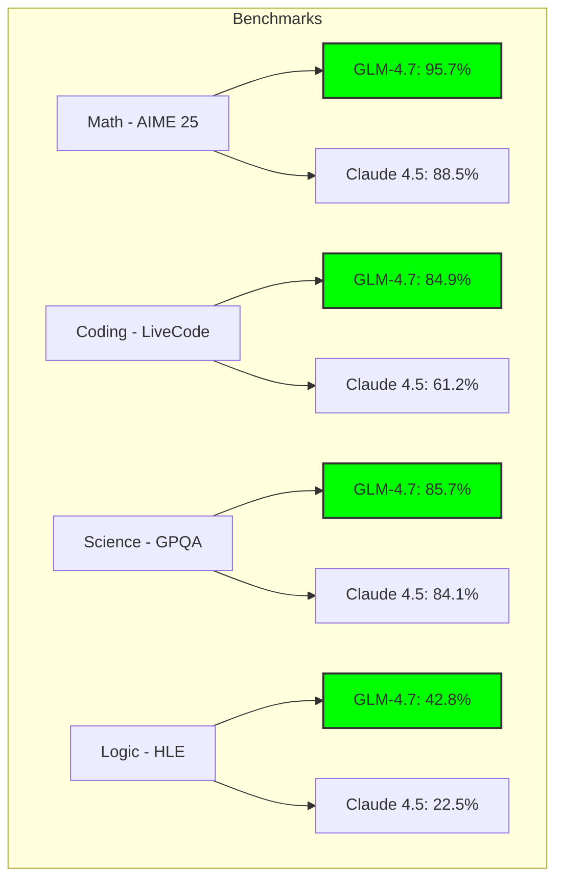
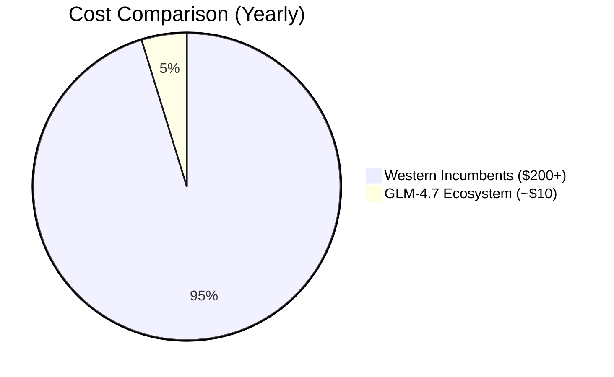

# 🚀 GLM-4.7 vs. The $200 Giants: Is China’s $3 AI Coding Tool the New Market King?

```text
██████╗ ██╗     ███╗   ███╗      ██╗  ██╗    ███████╗
██╔════╝ ██║     ████╗ ████║      ██║  ██║    ╚════██║
██║  ███╗██║     ██╔████╔██║█████╗███████║        ██╔╝
██║   ██║██║     ██║╚██╔╝██║╚════╝╚════██║       ██╔╝ 
╚██████╔╝███████╗██║ ╚═╝ ██║           ██║       ██║  
 ╚═════╝ ╚══════╝╚═╝     ╚═╝           ╚═╝       ╚═╝  
      THE FRONTIER AGENTIC REASONING MODEL (2025)
```

The global landscape for AI-powered development is shifting. While Western tools like Cursor and GitHub Copilot have dominated by charging premium subscription rates (often reaching $200 per year), a new contender from China has arrived to dismantle that pricing model.

**Zhipu AI** has released **GLM-4.7**, a large language model specifically engineered for coding, offering performance that rivals top-tier US models at a fraction of the cost. With a price point hovering around **$0.60 per 1M tokens**, GLM-4.7 is forcing developers to question if expensive subscriptions are still necessary.

---

## ⚔️ The Frontier Battle: Head-to-Head Benchmarks

GLM-4.7 doesn't just compete; it dominates the 2025 SOTA (State of the Art) benchmarks, outperforming giants like Claude 4.5 and Gemini 3 Pro in core agentic workflows.

### 📊 Performance Visualization


| Category | Benchmark | **GLM-4.7** | Claude 4.5 | Gemini 3 Pro | Winner |
| :--- | :--- | :--- | :--- | :--- | :--- |
| **Math** | AIME 25 | **95.7** | 88.5 | 90.2 | 🥇 GLM-4.7 |
| **Coding** | LiveCode | **84.9** | 61.2 | 72.0 | 🥇 GLM-4.7 |
| **Science** | GPQA | **85.7** | 84.1 | 83.0 | 🥇 GLM-4.7 |
| **Logic** | HLE | **42.8** | 22.5 | 30.0 | 🥇 GLM-4.7 |
| **Price** | Per 1M Tokens | **$0.60** | $15.00 | $1.25 | 🥇 GLM-4.7 |

---

## 🛠️ What is GLM-4.7? The Technical Breakdown

GLM-4.7 is the latest iteration of the General Language Model (GLM) series developed by Beijing-based **Zhipu AI**. Unlike general-purpose models, GLM-4.7 is optimized heavily for code generation and function calling.

### 🚀 Key Technical Highlights
- **Extended Context Window (200K):** Capable of handling massive codebases in a single prompt, allowing it to "remember" entire file structures better than any previous iteration.
- **Deep Thinking Mode:** Forced systematic reasoning for high-complexity architectural tasks. It traverses a "Tree of Thoughts" to ensure logic consistency.
- **All-Tools Capabilities:** Autonomously browses the web, executes code, and interprets data to solve complex engineering problems without human hand-holding.
- **Extreme Efficiency:** Proprietary architecture delivering high inference speeds at 25X lower cost than Claude 4.5 Opus.

---

## 📈 Why This Matters for the Future of DevOps

For CTOs and engineering managers, the calculation is changing. The "value add" of a $200 tool is no longer just about ability, but about **ROI**.

If a $3 model can perform 90% of the tasks that a $200 model can, the justification for high-cost enterprise licenses evaporates. This pressure will likely force Western competitors to lower prices or significantly boost their feature sets to maintain market share.

### 🔄 The ROI Shift


---

## ❓ FAQ: GLM-4.7 and the AI Coding Market

**Is GLM-4.7 better than GPT-4 for coding?**
While GPT-4 excels in general nuance, GLM-4.7 is highly competitive in pure coding syntax, debugging, and speed, especially for agentic workflows where multi-step reasoning is required.

**How much does the GLM-4.7 coding tool cost?**
The Lite plan starts as low as **$9/quarter** (with current promos), and API usage is approximately **$0.60 per 1M tokens**.

**Who makes GLM-4.7?**
GLM-4.7 is developed by **Zhipu AI**, a leading artificial intelligence company headquartered in Beijing, China.

**Can I use GLM-4.7 in the US?**
Yes, Zhipu AI offers global API access. It is already integrated into popular tools like **TRAE SOLO**, **Cline**, and **Roo Code**.

---

## 🎁 Special Christmas Offer

Don't miss out on the AI Coding Revolution. Get the most powerful model for the lowest price!

```text
 ___________________________________________________________
/                                                           \
|   🎄 GLM-4.7 CHRISTMAS EXCLUSIVE CODE 🎄                   |
|  _______________________________________________________  |
| |                                                       | |
| |   🎁  50% OFF FIRST PURCHASE                          | |
| |   🚀  +10% ADDITIONAL STACKABLE DISCOUNT              | |
| |_______________________________________________________| |
|                                                           |
|   INVITE CODE:  R0K78RJKNW                                |
|   STATUS:       ACTIVE [STRICTLY LIMITED]                 |
|                                                           |
\___________________________________________________________/
          \   ^__^
           \  (oo)\_______
              (__)\       )\/\
                  ||----w |
                  ||     ||
```

🔗 **Claim your discount here:** [https://z.ai/subscribe?ic=R0K78RJKNW](https://z.ai/subscribe?ic=R0K78RJKNW)
🎟️ **Invite Code:** `R0K78RJKNW`

---
*The era of the "$200 AI coding tax" is over. Join the GLM revolution today.*
